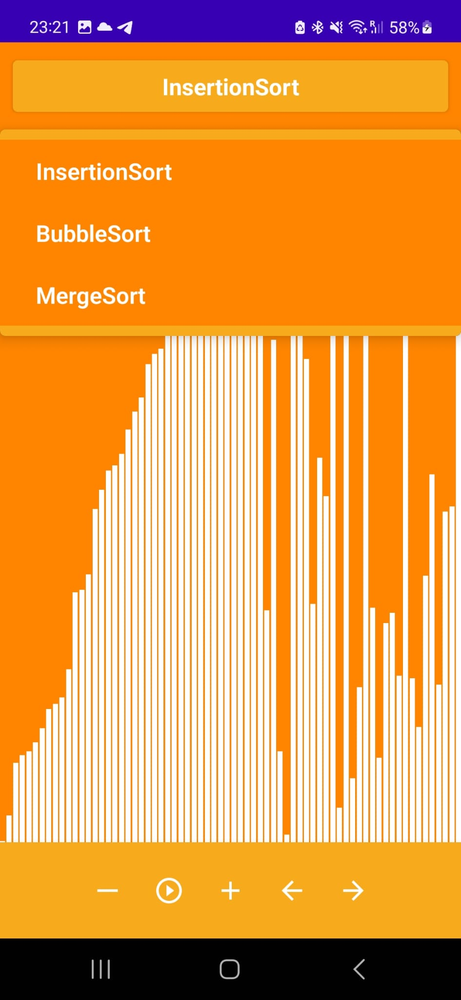
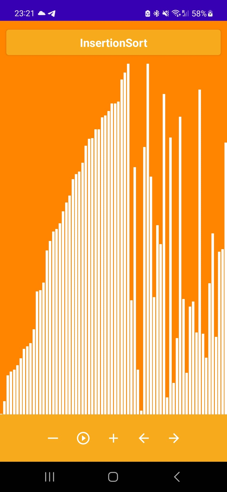
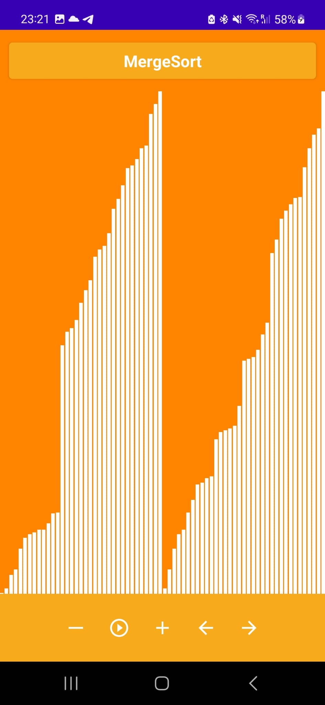

# Sorting Algorithm Visualizer

- The Application is built in Kotlin and Jetpack Compose and it uses Kotlin Coroutines to update the UI
- Users can see different types of sorting algorithms such as Merge Sort, Bubble Sort...
- Users have the possibility to slow down, speed up and stop the algorithm
- Users can go step by step to visualize the algorithm
  
## Screenshots

